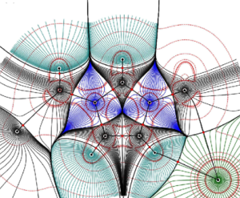

<style>
body {
text-align: justify}
</style>

```{r setup, include=FALSE}
knitr::opts_chunk$set(echo = FALSE)

```

```{r,out.width="80%",fig.align='center'}

```

# La Teoría de Átomos en Moléculas (*AIM - en Inglés*)

## Contexto Histórico

### Orígenes y Desarrollo

Durante las décadas de 1970 y 1980, Richard F. W. Bader, un destacado químico cuántico canadiense, desarrolló la revolucionaria teoría de 'Átomos en Moléculas' (AIM). Bader, tras completar su licenciatura y maestría en McMaster University, obtuvo su doctorado en el MIT en 1958. Durante su carrera académica en la University of Ottawa y posteriormente en McMaster University, Bader se dedicó a encontrar una forma precisa y rigurosa de definir los átomos dentro de una molécula.

### Desarrollo de AIM

En su búsqueda de esta definición, Bader observó que la densidad electrónica, ρ(r), podría ser utilizada para delimitar regiones atómicas dentro de una molécula. Esta observación fue el punto de partida para el desarrollo de la teoría AIM, que se basa en el análisis topológico de la densidad electrónica. La teoría establece que los átomos en una molécula se pueden identificar y definir mediante la topología de su densidad electrónica.

## La Historia de la Teoría AIM

### Los Primeros Años: Definiendo el Átomo

En los años 70, Bader y su equipo comenzaron a explorar cómo la densidad electrónica podría utilizarse para definir las regiones atómicas dentro de una molécula. Descubrieron que la topología de la densidad electrónica ofrecía una forma natural de dividir una molécula en átomos.

#### Conceptos Clave:

- **Densidad Electrónica (ρ(r))**: La densidad electrónica en un punto r describe la probabilidad de encontrar un electrón en esa posición. 

\[
\rho(\mathbf{r}) = \sum_{i=1}^N |\psi_i(\mathbf{r})|^2
\]

Esta ecuación muestra la densidad electrónica, donde \(\psi_i(\mathbf{r})\) son las funciones de onda de los electrones. La densidad electrónica es crucial para definir cómo se distribuyen los electrones alrededor de los núcleos atómicos en una molécula.

- **Gradiente de Densidad Electrónica (∇ρ(r))**: El gradiente de la densidad electrónica indica la dirección de mayor cambio en la densidad.

\[
\nabla \rho(\mathbf{r}) = \left( \frac{\partial \rho}{\partial x}, \frac{\partial \rho}{\partial y}, \frac{\partial \rho}{\partial z} \right)
\]

El gradiente de densidad electrónica es fundamental para identificar las superficies de interacción atómica, ya que muestra cómo cambia la densidad en diferentes direcciones.

### Principios AIM

1. **Puntos Críticos**:
   - **Núcleo (3,-3)**: Máximos locales de densidad, corresponden a los núcleos de los átomos.
   - **Enlace (3,-1)**: Puntos de silla que indican la existencia de enlaces químicos.
   - **Plano (3,+1) y Jaula (3,+3)**: Mínimos locales de densidad.

2. **Superficies de Interacción Atómica**:
   - Los átomos en una molécula se delimitan mediante superficies de cero flujo del gradiente de densidad electrónica. Estas superficies se encuentran resolviendo:

\[
\nabla \rho(\mathbf{r}) = 0
\]

Esta ecuación se utiliza para identificar puntos críticos en la densidad electrónica, determinando así los límites de los átomos dentro de una molécula.

### Publicación y Reconocimiento

En 1981, Bader publicó su teoría en el libro "Atoms in Molecules: A Quantum Theory". Aunque inicialmente encontró resistencia, su teoría eventualmente ganó aceptación y se convirtió en una herramienta fundamental en la química teórica y computacional.

## Aplicaciones de AIM

### Optimización de Geometrías

La teoría AIM permite definir átomos y estudiar sus interacciones dentro de una molécula, mejorando así la comprensión de la optimización de geometrías moleculares y la naturaleza de los enlaces químicos.

### Análisis de Enlaces

Los puntos críticos de enlace (BCP) son esenciales para caracterizar y entender enlaces covalentes, iónicos y no covalentes. La densidad electrónica en estos puntos y su curvatura proporcionan información crucial sobre la fuerza y naturaleza del enlace. La densidad en un BCP es dada por:

\[
\rho_{\text{BCP}} = \rho(\mathbf{r}_{\text{BCP}})
\]

Esta densidad proporciona información sobre la estabilidad y la naturaleza del enlace químico.

### Dinámica Molecular y Simulaciones

AIM se integra en muchos paquetes de software de química computacional, permitiendo realizar análisis topológicos de densidad electrónica en simulaciones de dinámica molecular.

## Ejemplo Ilustrativo: El Agua (H₂O)

1. **Cálculo de Densidad Electrónica**:
   Utilizamos un método como la DFT para calcular la densidad electrónica de H₂O.

2. **Identificación de Puntos Críticos**:
   Encontramos puntos críticos en los núcleos de oxígeno e hidrógeno (3,-3) y puntos críticos de enlace (3,-1) entre el oxígeno y cada hidrógeno.

3. **Análisis de Enlaces**:
   La densidad en los puntos críticos de enlace nos dice sobre la naturaleza covalente del enlace O-H.

4. **Definición de Átomos**:
   Las superficies de cero flujo delimitan el oxígeno y los hidrógenos, permitiendo calcular propiedades como la carga atómica integrando sobre estas regiones. La ecuación para la densidad en un punto crítico de enlace es:

\[
\left. \frac{\partial \rho}{\partial x_i} \right|_{\text{BCP}} = 0 \quad \forall i
\]

## Impacto de AIM

AIM ha tenido un impacto profundo en la química teórica y computacional. Su enfoque riguroso y matemático ha proporcionado una base sólida para estudios de estructura electrónica, reactividad química y diseño de materiales.
