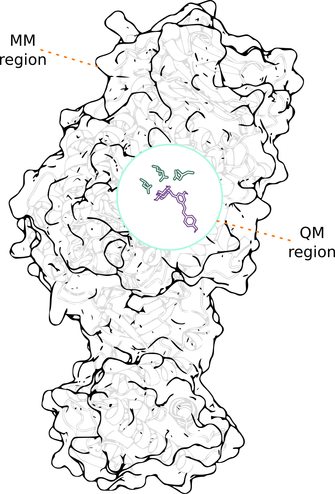

<style>
body {
text-align: justify}
</style>

```{r,out.width="40%",fig.align='center', echo=FALSE}

```

## Perspectiva General

En el campo de la **Química Computacional**, vamos a hablar sobre un tema fascinante: los cálculos QM/MM (Quantum Mechanics/Molecular Mechanics). Esta técnica híbrida combina métodos mecano-cuánticos y mecánica molecular, lo que permite estudiar sistemas grandes de manera eficiente.


<figure style="float: right; width: 55%; margin: 0 auto;">
  
</figure>

A lo largo de este post, utilizaremos como ejemplo una proteína con un ligando cualquiera, pero ten en cuenta que también es posible realizar cálculos QM/MM en diversas moléculas para distintas aplicaciones, como materiales orgánicos, complejos metálicos, fármacos, e incluso sistemas catalíticos. Además, mencionaré brevemente el uso de **Teoría del Funcional de la Densidad (DFT)**, una metodología común en los cálculos QM que se utiliza para describir con precisión la densidad electrónica de los sistemas.

En este post, te guiaré desde el principio para que puedas comprender los conceptos básicos y cómo funciona esta metodología en general. Además, veremos un ejemplo sencillo para ilustrar el funcionamiento de esta poderosa herramienta, que te será de utilidad incluso si estás empezando en el mundo de la química computacional.

¡Espero que disfrutes este viaje hacia la comprensión de una de las técnicas más útiles y emocionantes en el estudio de biomoléculas!

## Comencemos con lo fundamental: ¿Qué es QM/MM?

El enfoque QM/MM combina dos metodologías, **Mecánica Cuántica (QM)** y **Mecánica Molecular (MM)**, ambas de gran importancia para entender la dinámica de sistemas complejos:

- **Mecánica Cuántica (QM)**: Se utiliza para modelar una parte del sistema donde los efectos cuánticos son importantes, como en la reacción química de un sitio activo de una enzima. Aquí, se consideran explícitamente las rupturas y formaciones de enlaces químicos, lo cual es esencial para describir reacciones químicas de manera precisa. Por ejemplo, en una enzima, los enlaces del sustrato pueden romperse o formarse durante la reacción, y estos cambios solo pueden describirse con precisión utilizando la mecánica cuántica, ya que implican la redistribución de densidad electrónica (la distribución de los electrones en el espacio) y la creación de nuevos estados electrónicos (como la formación de nuevos enlaces). En este contexto, la **Teoría del Funcional de la Densidad (DFT)** es una técnica ampliamente utilizada que permite describir la densidad electrónica de manera eficiente y con un buen equilibrio entre precisión y costo computacional.

- **Mecánica Molecular (MM)**: Debido al costo computacional elevado en el cálculo QM, se usa la mecánica molecular para el resto del sistema, que generalmente incluye una gran cantidad de átomos (como un solvente o el resto de la proteína), de manera menos costosa computacionalmente. La mecánica molecular se encarga de modelar las interacciones de corto y largo alcance de estos átomos mediante potenciales clásicos. Las interacciones de corto alcance incluyen fuerzas como las repulsivas y atractivas de Van der Waals, mientras que las de largo alcance comprenden interacciones electrostáticas. Para tratar estas interacciones de largo alcance de manera eficiente, se utilizan algoritmos como el **PME (Particle Mesh Ewald)**, que permite calcular las fuerzas electrostáticas con alta precisión, incluso para sistemas muy grandes.

En el contexto de la química computacional, este enfoque permite reducir los requisitos de recursos al tiempo que mantiene la precisión para estudiar la parte más relevante del sistema.

## ¿Cómo se realiza un cálculo QM/MM?

Para realizar un cálculo QM/MM, es necesario utilizar un software especializado que permita combinar ambos enfoques, el cuántico y el molecular. Generalmente, se elige un software que se adapte bien a la naturaleza del sistema y que sea compatible con los métodos híbridos. Para comprender mejor el procedimiento, colocaré un ejemplo de cálculo y metodología para el análisis de una proteína y un ligando utilizando la interfaz **Qchem-CHARMM**, que permite realizar cálculos QM/MM de manera eficiente. Qchem se encarga de la parte cuántica, donde se modelan las reacciones y los procesos que involucran cambios en los enlaces químicos, mientras que CHARMM se encarga de la parte molecular, proporcionando el contexto completo de la proteína o del sistema en su totalidad.

<figure style="float: right; width: 40%; margin: 0 auto;">
  
</figure>

Primero, se debe definir qué parte del sistema será tratada con **QM** (generalmente el sitio activo o la región de interés donde ocurre una reacción) y qué parte se tratará con **MM** (el resto del sistema, como la proteína y el solvente). Luego, se configura la simulación con los parámetros adecuados para cada método, y se ejecuta la simulación utilizando la interfaz Qchem-CHARMM para integrar ambas partes del cálculo.

Para ilustrar mejor esta combinación de ambas zonas, a la derecha se muestra la imagen de un sistema proteico y su ligando, resaltando la región **QM** (el sitio activo), mientras que el resto del sistema es tratado con **MM** indicando su contribución al cálculo. Esto ayudará a visualizar cómo se dividen las regiones y cuál es el enfoque general de cada una.

Debido a la gran diversidad de sistemas, enzimas y reacciones, no existe una 'receta general' para los cálculos QM/MM. En este post, a modo de ejemplo, se presentará una forma de proceder, que es la que, personalmente yo, utilizo habitualmente en mis investigaciones.
Ésta incluye los siguientes pasos: optimizaciones geométricas, exploración de la energía potencial, búsqueda del camino de mínima energía, análisis de los resultados, y análisis de la energía y la estructura.

### Pasos Generales

1. **Optimización geométrica**: Se realiza una optimización de la estructura utilizando primero solo MM y luego una combinación QM/MM para ajustar las regiones de interés con precisión cuántica.

2. **Exploración de coordenada de reacción**: Se lleva a cabo un "scan", que consiste en optimizaciones geométricas a lo largo de una coordenada de reacción (RC). Esta coordenada de reacción se define mediante una combinación de distancias entre átomos y permite mapear cómo cambia la energía a medida que ocurre la reacción.

3. **Búsqueda del camino de mínima energía**: Una vez que se obtiene la trayectoria inicial a lo largo de la coordenada de reacción, se utiliza el algoritmo **CPR (Conjugate Peak Refinement)** implementado en el módulo **TREK** del software CHARMM para encontrar el camino de mínima energía. Este proceso permite identificar un camino adiabático de mínima energía (es decir, un camino en el que no se intercambia calor con el entorno) que conecte reactantes con productos. Así como también, el CPR logra identificar uno o más estados de transición (TS) verdaderos.

4. **Cálculo de energía puntual (single point energy)**: Seguidamente, se realiza un cálculo de energía puntual (single point energy) en los tres estados principales de la reacción: el reactante, el estado de transición (TS), y el producto. Esto se hace con un nivel de teoría mucho mejor (un modelo más preciso para describir el sistema cuántico) para recalcular las energías en estos tres puntos y mejorar los resultados de la barrera de energía asociada a la reacción.

5. **Análisis de los resultados**: Se realiza un análisis general de los resultados obtenidos. Esto incluye:

   - **Análisis estructural o geométrico**: Se examinan las estructuras optimizadas de los puntos estacionarios (reactante, estado de transición y producto) para identificar cambios importantes en las geometrías a lo largo de la reacción.

<figure style="text-align: center;">
  
  <figcaption style="font-style: italic;">Gráfico que muestra los tres puntos estacionarios de la reacción por la que pasa el camino de mínima energía: el reactivo (R), el estado de transición (TS) y el producto (P). [&sect;]</figcaption>
</figure>

   - **Diagramas de energía**: Se analizan los perfiles de energía para identificar la barrera energética asociada a la reacción y evaluar su viabilidad.

<figure style="text-align: center;">
  
  <figcaption style="font-style: italic;">Perfil de energía potencial vs una coordenada de reacción del "scan". Esta es una aproximación inicial que nos permitirá a continuación encontrar el camino de mínima energía. [&sect;]</figcaption>
</figure>

<div style="margin-top: 1cm;"></div>

<figure style="text-align: center;">
  
  <figcaption style="font-style: italic;">Cálculo de energía puntual (single point energy, en inglés) de los puntos estacionarios. Se muestra la barrera o energía de activación (8.8 kcal/mol) de la reacción catalizada por la enzima. [&sect;]</figcaption>
</figure>

   - **Análisis NBO (Natural Bond Orbital)**: Se investigan las cargas de los puntos estacionarios de la reacción para entender la distribución de la carga electrónica y cómo esta influye en la reactividad del sistema.

<figure style="text-align: center;">
  
  <figcaption style="font-style: italic;">Estado de transición de la reacción donde se muestran zonas coloreadas que indican las principales interacciones entre los átomos relacionados a la reactividad. [&sect;]</figcaption>
</figure>

## Conclusión:

En resumen, el enfoque QM/MM nos permite estudiar sistemas complejos de manera eficiente, combinando la precisión de la mecánica cuántica con la versatilidad y menor costo computacional de la mecánica molecular. A través de los pasos descritos —desde la optimización geométrica hasta el análisis de resultados—, es posible entender en detalle el mecanismo de reacción de biomoléculas y sistemas catalíticos. Los resultados obtenidos, integrando análisis energéticos, NBO y estructurales, nos brindan una visión completa del proceso reactivo, la cual puede ser comparada con otros sistemas similares para validar nuestras conclusiones. Esta poderosa metodología híbrida ha demostrado ser una herramienta esencial para desentrañar los complejos mecanismos de la química biomolecular, proporcionando información clave que puede guiar futuras investigaciones.

<div style="margin-top: 2cm;"></div>

 * Es importante recalcar que todo lo presentado en este post es solo una de las varias maneras de realizar un cálculo QM/MM, y que los pasos presentados aquí reflejan un ejemplo específico basado en mi experiencia de trabajo.

<div style="margin-top: 1cm;"></div>

### Nota a pie de página

[&sect;] Las imagenes colocadas en este post sirven como ejemplos ilustrativos de una de las maneras en las que se puede trabajar con el método QM/MM.
Para mayor información revisar el artículo publicado en la revista _Organic & Biomolecular Chemistry_ <sup>&dagger;</sup>. 

### Referencia

<sup>&dagger;</sup> *Febres-Molina, Camilo; Prat-Resina, Xavier; Jaña, Gonzalo A. 2023. “Resveratrol Glucosylation by GTF-SI from Streptococcus Mutans: Computational Insights into a GH70 Family Enzyme.” Organic & Biomolecular Chemistry 21 (48): 9591–9602.*
