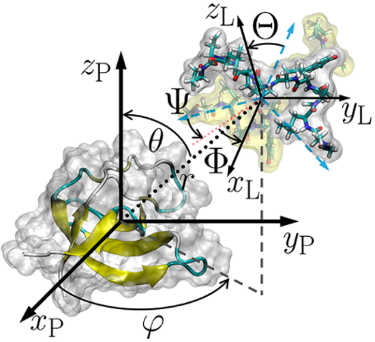
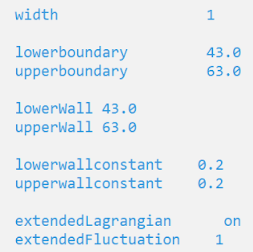
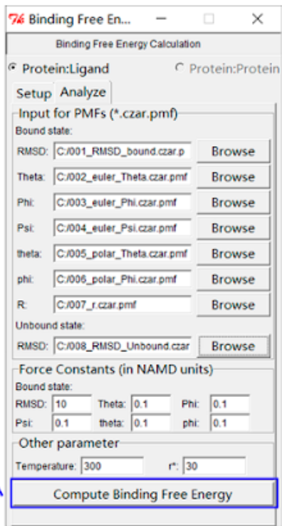

<style>
body {
text-align: justify}
</style>

```{r setup, include=FALSE}
knitr::opts_chunk$set(echo = FALSE)

# Learn more about creating blogs with Distill at:
# https://rstudio.github.io/distill/blog.html

```

_Este tutorial fue realizado en colaboración con [Leslie Sanchez](https://scholar.google.com.pe/citations?user=cM-RWEYAAAAJ&hl=es&oi=ao)._

<br/>

```{r,out.width="50%",fig.align='center'}

```

El plugin BFEE permite la generación de archivos de entrada para realizar el cálculo de &Delta;G absoluto de unión en NAMD usando variables colectivas [@bfee]. Los archivos de entrada se generan en el software VMD, con lo cual se generarán los archivos necesarios para realizar los cálculos de 8 carpetas. Posteriormente, el plugin permite el procesamiento de los datos.

El plugin se debe descargar desde la SI del artículo colocado en la sección final de Referencias, y que titula: ["BFEE: A User-Friendly Graphical Interface Facilitating Absolute Binding Free-Energy Calculations".](https://pubs.acs.org/doi/abs/10.1021/acs.jcim.7b00695)

En la SI también se encuentran las instrucciones de instalación tanto para Windows como para Linux y OSX. (En nuestra experiencia este Plugin responde mejor en Ubuntu que en Windows.)

# Generación de inputs:

Una vez instalado el plugin en VMD aparecerá en “extensions → my plugins → BFEE”. Para su uso es necesario tener archivos del sistema a trabajar equilibrado, ya que para generar los inputs se requieren los siguientes archivos del sistema → \*.psf, \*.coor, \*.vel, \*.xsc y los archivos de parámetros necesarios para el sistema en cuestión.

El plugin es bastante user-friendly, por lo que, al abrirlo se entiende dónde hay que poner los archivos requeridos, luego hay que pinchar la opción “generar inputs”, a partir de lo cual se generarán 8 carpetas, las cuales se deben transferir al cluster donde esté instalado NAMD.

# Correr los archivos en NAMD:

En cada carpeta habrá un archivo de configuración “abf.conf” que es el que contiene la información para correr el cálculo, del cual no es necesario modificar nada.

Además, en cada carpeta existe el archivo colvar.in, que tiene la información de las variables colectivas. Luego de algunos ensayos se observó que es necesario agregar los keywords “lowerWall” y “upperWall” luego de la información de lower y upperboundary, (los valores de los keywords mencionados deben ser iguales, como se muestra a continuación en un ejemplo:

```{r,out.width="50%",fig.align='center'}

```

Con esto listo se deben correr las carpetas desde la 001 a la 008 de forma sucesiva.

**Nota**: Considerar lo siguiente, la carpeta 007 consiste de una solvatación extra del sistema, por lo cual el plugin construye un nuevo psf y pdb donde la caja de agua es más extensa en tamaño, con lo cual crece el número de átomos (en algunos casos al triple). De esto se ha observado que en proteínas donde el número de átomos supere los ~150 - 200 mil átomos, el cálculo no se llevará a cabo, dado que se generan errores (al menos en la versión de NAMD que se tiene actualmente instalada en el cluster UDEC) por lo cual será necesario hacer modificaciones en el archivo de la carpeta 007 en caso de que se genere una proteína con un número de átomos muy grande.

Se ha seguido la siguiente metodología en carpeta 007 para llevar a cabo el cálculo:

Tomando como base el archivo bound.psf, bound.coor.pdb (carpeta 007_r), los archivos solvated.psf y solvated.pdb, ligand.pdb y protein.pdb fueron editados para reducir la cantidad de átomos (remover las moléculas de agua adicionales). Por lo que se realizó lo siguiente:

i. Los archivos bound.psf, bound.coor.pdb, se copiaron a solvated.psf y solvated.pdb. En el archivo solvated.pdb se agregó 1.00 en la columna A.

ii. Se tomó ligand.pdb de la carpeta 006 y se copió por ligand.pdb en la carpeta 007_r. Se agregó 1.00 en la columna A.

iii. Se tomó protein.pdb de la carpeta 006 y se copió por protein.pdb en carpeta 007_r. Se agregó 1.00 en la columna A.

iv. Debido a que el archivo solvated.pdb ahora es un sistema más pequeño se deben cambiar los valores de tamaño de celda en el archivo abf.conf, para lo cual se utiliza VMD para calcular los valores de celda y centro del sistema (tkconsole, comandos measure minmax y measure center).


# Procesamiento de datos:
	
Una vez finalizado el cálculo en las 8 carpetas se observará que cada carpeta contiene una carpeta “output” donde se fueron escribiendo diferentes archivos de salida, entre ellos una trayectoria \*.dcd y el archivo que permitirá obtener el valor de energía libre, \*.czar.pmf, los cuales se deben cargar en la ventana del plugin “analyze” y luego pinchar “compute binding free energy” con lo cual se obtendrá el valor final de energía libre absoluta (a continuación se incluye una imagen de la ventana del plugin donde se deben cargar los respectivos outputs).

```{r,out.width="50%",fig.align='center'}

```
