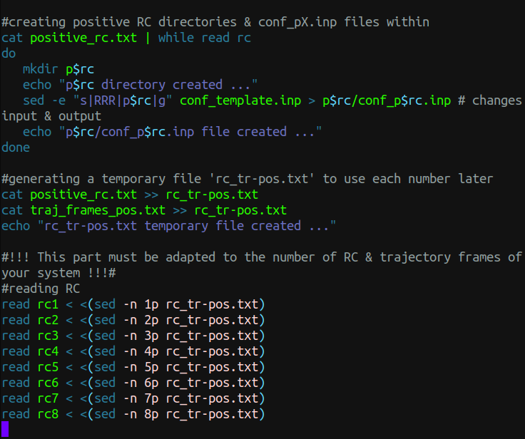

<style>
body {
text-align: justify}
</style>

```{r setup, include=FALSE}
knitr::opts_chunk$set(echo = FALSE)
```

```{r,out.width="50%",fig.align='center'}

```

# Indicaciones iniciales

Los siguientes dos scripts en Bash requieren de otros archivos en los que les proporcionaremos las ventanas de simulación, los frames que corresponden a dichas ventanas de simulación, los archivos 'input' plantilla para enviar los cálculos a CHARMM, y finalmente, los archivos 'input' que generarán otros archivos necesarios para las dinámicas QM/MM.

Por lo tanto, los archivos que deben estar en la misma dirección para lograr generar satisfactoriamente las carpetas con los archivos de entrada correspondientes a cada una de las ventanas negativas y positivas son los siguientes:

- 01-create_conf-cfm.sh;  &nbsp; &nbsp; &nbsp; <-- _Los scripts_
- 02-create_us_eq-cfm.sh;

- negative_rc.txt;  &nbsp; &nbsp; &nbsp; &nbsp; &nbsp; &nbsp; &nbsp; &nbsp; &nbsp; &nbsp; <-- _Y los archivos extras_
- positive_rc.txt;
- traj_frames_neg.txt;
- traj_frames_pos.txt
- conf_template.inp;
- us_eq_template.inp;
- makenew_cns.inp;
- makenew_reg.inp;

# Scripts y archivos extra

01-create_conf-cfm.sh:

```
#!/bin/bash

### ### ### ### ### ### ### ### ### ### ### ### ### ### ### ### ###
###                                                             ###
###   This script creates configure files for PMF calculation   ###
###        Run this script before 02-create_us_eq-cfm.sh        ###
###       Needs the following things in the same directory:     ###
###               negative_rc.txt, traj_frames_*.txt,           ###
###                conf_template.inp, makenew_*inp,             ###
###                        positive_rc.txt                      ###
###        (Remember to address the .crd, .psf, .dcd &          ###
###         parameters files in the conf_template file)         ###
###   Note: There is a part (mentioned below) that must be      ###
###         adapted to the number of RC & trajectory frames     ###
###         of your system.                                     ###
###   by CFM                                                    ###

### First part: negative RC ###  

#creating negative RC directories & conf_nX.inp files within
cat negative_rc.txt | while read rc
do
   mkdir n$rc
   echo "n$rc directory created ..."
   sed -e "s|RRR|n$rc|g" conf_template.inp > n$rc/conf_n$rc.inp # changes input & output
   echo "n$rc/conf_n$rc.inp file created ..."
done

#generating a temporary file 'rc_tr-neg.txt' to use each number later
cat negative_rc.txt >> rc_tr-neg.txt
cat traj_frames_neg.txt >> rc_tr-neg.txt
echo "rc_tr-neg.txt temporary file created ..."

#!!! This part must be adapted to the number of RC & trajectory frames of your system !!!#
#reading RC
read rc1 < <(sed -n 1p rc_tr-neg.txt)
read rc2 < <(sed -n 2p rc_tr-neg.txt)
read rc3 < <(sed -n 3p rc_tr-neg.txt)
read rc4 < <(sed -n 4p rc_tr-neg.txt)
read rc5 < <(sed -n 5p rc_tr-neg.txt)
read rc6 < <(sed -n 6p rc_tr-neg.txt)
read rc7 < <(sed -n 7p rc_tr-neg.txt)
read rc8 < <(sed -n 8p rc_tr-neg.txt)

#reading trajectory frames
read fr1 < <(sed -n 9p rc_tr-neg.txt)
read fr2 < <(sed -n 10p rc_tr-neg.txt)
read fr3 < <(sed -n 11p rc_tr-neg.txt)
read fr4 < <(sed -n 12p rc_tr-neg.txt)
read fr5 < <(sed -n 13p rc_tr-neg.txt)
read fr6 < <(sed -n 14p rc_tr-neg.txt)
read fr7 < <(sed -n 15p rc_tr-neg.txt)
read fr8 < <(sed -n 16p rc_tr-neg.txt)

#correlating each frame of trajectory with its appropriate RC conf file
sed -i "s|TTT|$fr1|g" n$rc1/conf_n$rc1.inp
echo "n$rc1/conf_n$rc1.inp file correctly correlated ..."
sed -i "s|TTT|$fr2|g" n$rc2/conf_n$rc2.inp
echo "n$rc2/conf_n$rc2.inp file correctly correlated ..."
sed -i "s|TTT|$fr3|g" n$rc3/conf_n$rc3.inp
echo "n$rc3/conf_n$rc3.inp file correctly correlated ..."
sed -i "s|TTT|$fr4|g" n$rc4/conf_n$rc4.inp
echo "n$rc4/conf_n$rc4.inp file correctly correlated ..."
sed -i "s|TTT|$fr5|g" n$rc5/conf_n$rc5.inp
echo "n$rc5/conf_n$rc5.inp file correctly correlated ..."
sed -i "s|TTT|$fr6|g" n$rc6/conf_n$rc6.inp
echo "n$rc6/conf_n$rc6.inp file correctly correlated ..."
sed -i "s|TTT|$fr7|g" n$rc7/conf_n$rc7.inp
echo "n$rc7/conf_n$rc7.inp file correctly correlated ..."
sed -i "s|TTT|$fr8|g" n$rc8/conf_n$rc8.inp
echo "n$rc8/conf_n$rc8.inp file correctly correlated ..."

rm rc_tr-neg.txt
#!!! !!! !!! !!! !!! !!! !!! !!! !!! !!!  !!! !!! !!! !!! !!! !!! !!! !!! !!! !!! !!! !!!#

#copying some relevant files down to the nRC directories & executing the conf file
cat negative_rc.txt | while read rc
do
   cp makenew_*inp n$rc/
   cp -r toppar* n$rc/ #copying parameters file & directory for the protein
   cp -r 7kp/ n$rc/ #copying parameters directory for the ligand
   echo "Relevant files copied down to n$rc/ directory ..."
   echo "Executing n$rc/conf_n$rc.inp file in charmm..."
   cd n$rc
   /opt/charmm-45b2/exec/gnu_M/charmm < conf_n$rc.inp > conf_n$rc.out
   cd ..
done

###   Second part: positive RC ###

#creating positive RC directories & conf_pX.inp files within
cat positive_rc.txt | while read rc
do
   mkdir p$rc
   echo "p$rc directory created ..."
   sed -e "s|RRR|p$rc|g" conf_template.inp > p$rc/conf_p$rc.inp # changes input & output
   echo "p$rc/conf_p$rc.inp file created ..."
done

#generating a temporary file 'rc_tr-pos.txt' to use each number later
cat positive_rc.txt >> rc_tr-pos.txt
cat traj_frames_pos.txt >> rc_tr-pos.txt
echo "rc_tr-pos.txt temporary file created ..."

#!!! This part must be adapted to the number of RC & trajectory frames of your system !!!#
#reading RC
read rc1 < <(sed -n 1p rc_tr-pos.txt)
read rc2 < <(sed -n 2p rc_tr-pos.txt)
read rc3 < <(sed -n 3p rc_tr-pos.txt)
read rc4 < <(sed -n 4p rc_tr-pos.txt)
read rc5 < <(sed -n 5p rc_tr-pos.txt)
read rc6 < <(sed -n 6p rc_tr-pos.txt)
read rc7 < <(sed -n 7p rc_tr-pos.txt)
read rc8 < <(sed -n 8p rc_tr-pos.txt)

#reading trajectory frames
read fr1 < <(sed -n 9p rc_tr-pos.txt)
read fr2 < <(sed -n 10p rc_tr-pos.txt)
read fr3 < <(sed -n 11p rc_tr-pos.txt)
read fr4 < <(sed -n 12p rc_tr-pos.txt)
read fr5 < <(sed -n 13p rc_tr-pos.txt)
read fr6 < <(sed -n 14p rc_tr-pos.txt)
read fr7 < <(sed -n 15p rc_tr-pos.txt)
read fr8 < <(sed -n 16p rc_tr-pos.txt)

#correlating each frame of trajectory with its appropriate RC conf file
sed -i "s|TTT|$fr1|g" p$rc1/conf_p$rc1.inp
echo "p$rc1/conf_p$rc1.inp file correctly correlated ..."
sed -i "s|TTT|$fr2|g" p$rc2/conf_p$rc2.inp
echo "p$rc2/conf_p$rc2.inp file correctly correlated ..."
sed -i "s|TTT|$fr3|g" p$rc3/conf_p$rc3.inp
echo "p$rc3/conf_p$rc3.inp file correctly correlated ..."
sed -i "s|TTT|$fr4|g" p$rc4/conf_p$rc4.inp
echo "p$rc4/conf_p$rc4.inp file correctly correlated ..."
sed -i "s|TTT|$fr5|g" p$rc5/conf_p$rc5.inp
echo "p$rc5/conf_p$rc5.inp file correctly correlated ..."
sed -i "s|TTT|$fr6|g" p$rc6/conf_p$rc6.inp
echo "p$rc6/conf_p$rc6.inp file correctly correlated ..."
sed -i "s|TTT|$fr7|g" p$rc7/conf_p$rc7.inp
echo "p$rc7/conf_p$rc7.inp file correctly correlated ..."
sed -i "s|TTT|$fr8|g" p$rc8/conf_p$rc8.inp
echo "p$rc8/conf_p$rc8.inp file correctly correlated ..."

rm rc_tr-pos.txt
#!!! !!! !!! !!! !!! !!! !!! !!! !!! !!!  !!! !!! !!! !!! !!! !!! !!! !!! !!! !!! !!! !!!#

#copying some relevant files down to the pRC directories & executing the conf file
cat positive_rc.txt | while read rc
do
   cp makenew_*inp p$rc/
   cp -r toppar* p$rc/ #copying parameters file & directory for the protein
   cp -r 7kp/ p$rc/ #copying parameters directory for the ligand
   echo "Relevant files copied down to p$rc/ directory ..."
   echo "Executing p$rc/conf_p$rc.inp file in charmm..."
   cd p$rc
   /opt/charmm-45b2/exec/gnu_M/charmm < conf_p$rc.inp > conf_p$rc.out
   cd ..
done

echo "Done."

###                                                             ###
###                       End of this script                    ###
###                                                             ###
### ### ### ### ### ### ### ### ### ### ### ### ### ### ### ### ###
```


02-create_us_eq-cfm.sh:

```
#!/bin/bash

### ### ### ### ### ### ### ### ### ### ### ### ### ### ### ### ###
###                                                             ###
###  This script creates equilibration files for US - QM/MM MD  ###
###             Run this after 01-create_conf-cfm.sh            ###
###            Additionally needs the following files           ###
###                      in the same directory:                 ###
###                 us_eq_template.inp, sccdftb.dat             ###
###          (Remember to define your qm zone, charge &         ###
###         other parameters in the us_eq_template file)        ###
###   by CFM                                                    ###

### First part: negative RC ###  

#creating the eq_nX.inp file & copying sccdftb.dat file
cat negative_rc.txt | while read rc
do
   d1=`echo $rc | cut -b 1`
   d2=`echo $rc | cut -b 2`
   sed -e "s|TTT|-$d1.$d2|g" us_eq_template.inp > n$rc/eq_n$rc.inp   #putting the RC
   sed -i "s|RRR|n$rc|g" n$rc/eq_n$rc.inp   #changing the input & output
   echo "n$rc/eq_n$rc.inp file created ..."
   cp sccdftb.dat n$rc
done

### Second part: positive RC ###

#creating the eq_pX.inp file & copying sccdftb.dat file
cat positive_rc.txt | while read rc
do
   d1=`echo $rc | cut -b 1`
   d2=`echo $rc | cut -b 2`
   sed -e "s|TTT|$d1.$d2|g" us_eq_template.inp > p$rc/eq_p$rc.inp   #putting the RC
   sed -i "s|RRR|p$rc|g" p$rc/eq_p$rc.inp   #changing the input & output
   echo "p$rc/eq_p$rc.inp file created ..."
   cp sccdftb.dat p$rc
done

echo "Done."

###                                                             ###
###                       End of this script                    ###
###                                                             ###
### ### ### ### ### ### ### ### ### ### ### ### ### ### ### ### ###
```


A continuación se muestran ejemplos arbitrarios de los archivos extra arriba mencionados:

- negative_rc.txt:


- traj_frames_neg.txt:


- conf_template.inp:

```
!Configuracion para crear esfera con zonas definidas, para hacer umbrella sampling - example

bomlev -1
set d .
set stream ~/utils/stream
set input RRR
set output RRR

stream toppar_wo.str

open read form unit 1 name ~/umbrella/gtfwt_cryst.psf
READ psf card unit 1
close unit 1

open read form unit 1 name ~/umbrella/prod.crd
READ coord card unit 1
close unit 1

! .1define the substrate stereocenter as the origin of coordinates
define cntr1 sele segid HETA .and. type C1 end

! .2moving
coor stat sele cntr1 end
coor translate xdir -?xave ydir -?yave zdir -?zave sele all end

! .3checking center
coor stat sele cntr1 end

open read unit 3 file name ~/umbrella/path.dcd
read coord file unit 3 ifile TTT
close unit 3

dele atom sele .byres. ( .not. ( point 0.0 0.0 0.0 cut 30.0)) end

!-----------regions
set xcen     0.0
set ycen     0.0
set zcen     0.0
set rsphere 25.0         ! radius of the spherical region of interest
set rexcl    2.0         ! water exclusion radius
set rgeo     4.0         ! to setup the MMFP potential
calc rwater  = @rsphere - @rexcl
calc rdroff  = @rsphere - @rgeo
set temp   310.0 !for lang region

stream @stream/writeall.inp
stream @stream/input.inp
stream makenew_reg.inp
stream makenew_cns.inp  

end
```

- us_eq_template.inp:

```
! Equilibrium MD for umbrella sampling - example

bomlev -2
!----files
set input RRR
set output RRR
set loadcrd  0 !load @restart.crd before any min or md
set loadres  0 !load @restart.res before any min or md
set loadpdb  0 !load @restart.res before any min or md
!set mijinp   1v54.fsph30.mij.25.mij
!set phiinp   1v54.fsph30.phi
!----directories
set d .
set stream ~/utils/stream

!-----keywords
set kumb 100.0
set del0 TTT
!-----------elec options
set nbond ext
!set nbond atcut
!set polgsbp 25
!-----------min op
set minon  0
set minrun abnr
set minstep 50
set minprint 1
set mintolg 0.01
!-----------md op
set mdon  1
set mdrun  start
!set mdseed 314159
set mdtype lang
set timest 0.001
set mdstep 10000
set mdfirst 100
set mdtemp 310
set ieqfrq 500.0 !higher than 0.0 for equilibration
!
!-----------regions (consistens with regions/constants file)
set xcen     0.0
set ycen     0.0
set zcen     0.0
set rsphere 25.0         ! radius of the spherical region of interest
set rexcl    2.0         ! water exclusion radius 
set rgeo     4.0         ! to setup the MMFP potential + Langevin(buffer) zone
calc rwater  = @rsphere - @rexcl
calc rdroff  = @rsphere - @rgeo

stream toppar_wo.str

stream @stream/input.inp

stream @stream/nbond_atcut.inp
!set langevin environment
stream @stream/sbc.inp
!what is fixed and what moves (consistent with sbc)
! apply regdef and mmfp altogether
stream @stream/regdef.inp !fix(3-bonds rule) and scale 0.0 charges
!cons fix sele resname CU2 end ! CUa is very close to the edge we dont have parameter
stream @stream/mmfp_sph.inp

define asp sele segid PROA .and. resid 477 .and.( .not. (type CA .or. type HA -
 .or. type N .or. type HN .or. type C .or. type O )) end

define glup sele segid PROA .and. resid 515 .and.( .not. (type CA .or. type HA - 
 .or. type N .or. type HN .or. type C .or. type O )) end

define asp2 sele segid PROA .and. resid 588 .and.( .not. (type CA .or. type HA -
 .or. type N .or. type HN .or. type C .or. type O )) end

define wo67 sele segid HETB .and. resid 1167 end

define wo96 sele segid HETB .and. resid 1196 end

define qm sele asp .or. glup .or. segid HETA .or. asp2 .or. wo67 .or. wo96 end

scalar WMAIN set 1.0 sele (qm) .and. type O*  SHOW end
scalar WMAIN set 2.0 sele (qm) .and. type N*  SHOW end
scalar WMAIN set 3.0 sele (qm) .and. type C*  SHOW end
scalar WMAIN set 4.0 sele (qm) .and. type H*  SHOW end
scalar WMAIN set 4.0 sele (qm) .and. type QQ*  SHOW end

SCCDFTB remove CHRG -2 SELE QM END TEMP 0.00 SCFT 0.00000001  D3RD HBOND

!------Load current geom--
if loadcrd lt 1 goto noloadcrd
open read unit 3 card name @d/@restart.crd
read coor card unit 3
close unit 3

label noloadcrd
!------Load current geom--
if loadres lt 1 goto noloadres
open read unit 3 card name @d/@restart.res
read coor dynr curr unit 3
close unit 3

label noloadres
!------Load current geom--
if loadpdb lt 1 goto noloadpdb
open read unit 3 card name @d/@restart.pdb
read coor pdb unit 3
close unit 3

label noloadpdb

open write unit 3 card name @output.qm.pdb
write coor pdb sele qm end unit 3
close unit 3

rxncor: define o1   point sele atom HETA 1 O1 end
rxncor: define c1   point sele atom HETA 1 C1 end
rxncor: define oasp point sele atom PROA 477 OD1 end
rxncor: define a3   dist o1 c1
rxncor: define a4   dist c1 oasp

rxncor: define RC combin a3 1.0 a4 -1.0
rxncor: set nrxn 1 RC

open unit 29 form write name  @d/@output.rc

rxncor: trace RC unit 29

rxncor: umbrella name RC kumb @kumb del0 @del0 form 1 
rxncor: statistics name RC lowdelta -1.7 hidelta 1.5 deldel 0.1 start 1000
!energy
!-------MIN -------------
if minon lt 1 goto nomin
!open write unit 11 uform name @output.min.dcd
!mini @minrun nstep @minstep nprint @minprint tolg @mintolg iuncrd 11 nsavc 3
mini @minrun nstep @minstep nprint @minprint tolg @mintolg

label nomin

if mdon lt 1 goto nomd
!shake bonh tolerance 1.0e-06 MXIT 1500

open unit 24 form read  name @d/@restart.res
open unit 25 form write name @d/@output.res
open unit 26 file write name @d/@output.dcd
open unit 21 form write name @d/@output.static 

dynamics @mdtype @mdrun timestep @timest nstep @mdstep nprint 10 iprfrq 500 -
    firstt @mdfirst finalt @mdtemp tstruc @mdtemp TEMINC 5.0 twindl -10.0 twindh 10.0 -
    IHTFRQ 0 IEQFRQ @ieqfrq NTRFRQ 0 ISVFRQ 100 -
    IASORS 0 IASVEL 1 ISCVEL 0 ICHECW 0 ISEED iseed -
    iunrea 24 iunwri 25 iuncrd 26 iunvel -1 kunit 20 nsavc 100 nsavv 0 -
    inbfrq -1 imgfrq 0 ilbfrq -1 ihbfrq 0 tbath @mdtemp rbuffer @rdroff

rxncor: write unit 21
close unit 21
close unit 25
close unit 26

label nomd

open write unit 3 card name qm.@output.pdb
write coor pdb sele qm end unit 3
close unit 3

stream @stream/write.inp

stop
```

- makenew_cns.inp

```
* constraints
*
OPEN UNIT 3 NAME @d/@input.reg READ FORM
READ  COOR COMP CARD UNIT 3
CLOSE UNIT 3


! atoms beyond 18A will be held fixed, so only need to add constraints to
! buffer region atoms within that cutoff
!set 1 20.0    ! radius for fully mobile region
!set 2 24.0    ! radius of inner region
!set 3 22.0    ! radius of buffer region where Langevin dynamics will be used

! Setting various boundary flags
scalar xcomp store 1    ! initial md region
scalar ycomp store 2    ! initial buffer region
scalar zcomp store 3    ! initial Langevin atoms-proteins only
scalar wcomp store 4    ! reservoir region atoms

! Convert crystallographic thermal factors in wmain to constraint forces
scalar wmain reci sele recall 3 end               ! get 1/B
scalar wmain mult 0.001987191 sele recall 3 end   ! k(boltz)/B
scalar wmain mult @temp sele recall 3 end         ! kT/B
scalar wmain mult 4.0 sele recall 3 end           ! 4kT/B
scalar wmain mult 9.87 sele recall 3 end          ! 4(pi**2)kT/B
scalar wmain set 0.0 sele .not. recall 3 end      ! zero out the rest
scalar wmain store 5

scalar xcomp set 0.0 sele all end
scalar ycomp set 0.0 sele all end
scalar zcomp set 0.0 sele all end
scalar wcomp set 0.0 sele all end

scalar xcomp recall 3                    ! langevin region constraint flags
scalar zcomp set 1.0 sele recall 3 .or. (resn TIP3 .and. type OH2) end
scalar zcomp mult 80.0 sele recall 3 end                     ! protein friction
scalar zcomp mult 80.0 sele (resn TIP3 .and. type OH2) end   ! TIP3 friction
scalar ycomp recall 5                    ! unscaled constraint force constants
scalar wcomp recall 1

open unit 15 write form name  @d/@output.cnu
write coor comp card unit 15
* col. 1: langevin region constraint flags
* col. 2: UNSCALED langevin region harmonic constraint forces
* col. 3: langevin friction coefficients.
* col. 4: MD region flags.
*
! ****** Scale the constraints based on where the atoms are ******
! Values of S(r) for scaling the constraint forces

set 4 0.00 !inner langevin region
set 5 0.08 !next
set 6 0.20 !next
set 7 0.32 !next
set 8 0.44 !next
set 9 0.50 !next

!calc zones for scaling
calc lang = @rsphere - @rdroff
calc lang4 = @rdroff 
calc lang5 = @rdroff + 0.5
calc lang6 = @rdroff + 1.0
calc lang7 = @rdroff + 1.5
calc lang8 = @rdroff + 2.0

!force constant scaling
scalar xcomp store 1
scalar ycomp mult @4 sele ( recall 1 .and. point @xcen @ycen @zcen cut @lang4 ) end
scalar ycomp mult @5 sele ( recall 1 .and. point @xcen @ycen @zcen cut @lang5 -
                            .and. .not. point @xcen @ycen @zcen cut @lang4 ) end
scalar ycomp mult @6 sele ( recall 1 .and. point @xcen @ycen @zcen cut @lang6 -
                            .and. .not. point @xcen @ycen @zcen cut @lang5 ) end
scalar ycomp mult @7 sele ( recall 1 .and. point @xcen @ycen @zcen cut @lang7 -
                            .and. .not. point @xcen @ycen @zcen cut @lang6 ) end
scalar ycomp mult @8 sele ( recall 1 .and. point @xcen @ycen @zcen cut @lang8 -
                            .and. .not. point @xcen @ycen @zcen cut @lang7 ) end
scalar ycomp mult @9 sele ( recall 1 .and. .not. point @xcen @ycen @zcen cut @lang8 ) end

!friction scaling
scalar zcomp mult @4 sele (recall 1 .and. point @xcen @ycen @zcen cut @lang4 -
       .and. .not. resn TIP3) end
scalar zcomp mult @5 sele (recall 1 .and. point @xcen @ycen @zcen cut @lang5 -
       .and. .not. (point @xcen @ycen @zcen cut @lang4 .or. resn TIP3)) end
scalar zcomp mult @6 sele (recall 1 .and. point @xcen @ycen @zcen cut @lang6 -
       .and. .not. (point @xcen @ycen @zcen cut @lang5 .or. resn TIP3)) end
scalar zcomp mult @7 sele (recall 1 .and. point @xcen @ycen @zcen cut @lang7 -
       .and. .not. (point @xcen @ycen @zcen cut @lang6 .or. resn TIP3)) end
scalar zcomp mult @8 sele (recall 1 .and. point @xcen @ycen @zcen cut @lang8 -
       .and. .not. (point @xcen @ycen @zcen cut @lang7 .or. resn TIP3)) end
scalar zcomp mult @9 sele (recall 1 .and. .not. -
       (point @xcen @ycen @zcen cut @lang8 .or. resn TIP3)) end

open unit 14 write form name @d/@output.cns
write coor comp card unit 14
* col. 1: langevin region constraint flags
* col. 2: SCALED langevin region harmonic constraint forces
* col. 3: SCALED langevin friction coefficients.
* col. 4: MD region flags.

stop
```


- makenew_reg.inp

```
* center at Cu
*
! atoms beyond ? will be held fixed, so only need to add constraints to
! buffer region atoms within that cutoff
!set 1 20.0    ! radius for fully mobile region
!set 2 24.0    ! radius of inner region
!set 3 22.0    ! radius of buffer region where Langevin dynamics will be used
!set 1 @rdroff    ! radius for fully mobile region
!set 2 @rsphere   ! radius of inner region
!set 3 @rwater    ! radius of buffer region where Langevin dynamics will be used

!all comments were written in a 24/22/20 partition. but the input is general

scalar xcomp set 0.0
scalar ycomp set 0.0
scalar zcomp set 0.0
scalar wcomp set 0.0

! INNER, MOBILE REGION
! residues with at least one atom within 20-A and
!   with no main chain atoms outside of 22-A
scalar xcomp set 1.0 -
         sele  ( .byres. ( point @xcen @ycen @zcen cut @rdroff ) ) -
        .and. .not. (( type C  .or. type O  .or. type N .or. -
                      type CA .or. type HA .or. type HN) -
        .and. .not. ( point @xcen @ycen @zcen cut @rwater )) end
scalar xcomp store 1

! INITIAL BUFFER REGION
! residues with at least one atom within 24-A,  but not already
!  included in the inner, mobile region
scalar ycomp set 1.0 sele ( .byres. ( point @xcen @ycen @zcen cut @rsphere ) ) -
        .and. .not. recall 1 end
scalar ycomp store 2

! PROTEIN LANGEVIN ATOMS
! all atoms, except hydrogens and waters in the buffer region
scalar zcomp set 1.0 sele recall 2 .and. .not. -
        ( hydrogen .or. lone .or. resname tip3 ) end
scalar zcomp store 3

! OUTER REGION ATOMS
! any atom not in the inner or buffer regions
scalar wcomp set 1.0 sele .not. (recall 1 .or. recall 2 ) end
scalar wcomp store 4
!write out the new psf and crd, as well as partition.

open unit 13 write form name @d/@output.reg
write coor card comp unit 13
* column 1: reaction region 16 A by residue partioning
* column 2: Buffer region atoms, any atoms (byres) within @rsphere A but
*           not in @rdroff A plus all main chain atoms outside @rwater A
* column 3: Protein Langevin atoms (same as col. 2 but no H or tip3).
* column 4: Outer region atoms
*

return
```

Finalmente, cabe destacar dos cosas:

- Se debe recordar direccionar correctamente los archivos de coordenadas (.crd), de topología (.psf), trayectoria (.dcd) y los parámetros en el archivo _conf_template.inp_

- Para ejecutar los scripts en bash, primero se les debe dar permiso de ejecución, por ejemplo, así: _chmod +x 01-create_conf-cfm.sh_ y luego correrlos de la siguiente manera: _./01-create_conf-cfm.sh_

Todo lo anterior generará las carpetas y los archivos necesarios para poder realizar Umbrella Sampling  (QM/MM MD) utilizando la interfaz CHARMM-Gaussian.
